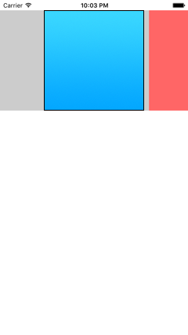
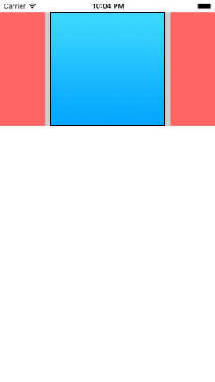
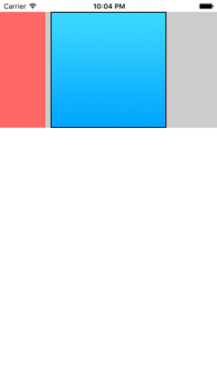

# ios-swift-practices
iOS practices with Swift language

## Practice 1: setup initial view controller programmatically


* Setup initial view controller programmatically
* Setup UITabBarController and its viewControllers programmatically

## Practice 2: show AlertView & ActionSheet by UIAlertController


Reference: [UIAlertController (NSHipster)](http://nshipster.com/uialertcontroller/)

* Setup UITableViewController as intial view controller
* Register cell: `tableView.registerClass(UITableViewCell.self, forCellReuseIdentifier: cellReuseIdentifier)`
* Show 3 kinds of AlertView & 2 kinds of ActionSheet

## Practice 3: add reminder by UILocalNotification


* Register local notification with Swift 2 literal

  ```swift
  UIUserNotificationSettings(forTypes: .Alert | .Badge | .Sound], categories: nil)
      |
      v
  UIUserNotificationSettings(forTypes: [.Alert, .Badge, .Sound], categories: nil)
  ```

* Add a simple minutes reminder

  > **Reference:** http://jamesonquave.com/blog/local-notifications-in-ios-8-with-swift-part-1/

## Practice 4: Make a simple calculator


* Make a calculator layout like iOS native Calculator
* Practice MVC design pattern (Refer to 2015 CS193P Lecture 2 & 3)

## Practice 5: Make blur effect with UIVisualEffectView


* Show blur effect: Light / Light / Dark / Extra Light
* Show vibrancy effect: None / Light / Dark / Extra Light
* This practice is done by StoryBoard. (No source code included)
  - Blur effect UIVisualEffectView should be added in the same layer of target image view
  - Vibrancy effect is set by UIVisualEffectView and nested in another blur effect UIVisualEffectView
* Blur & vibrancy effect can be done by code, please see reference

  > **Reference:** https://github.com/ide/UIVisualEffects

## Practice 6: Make a horizontal photo list


| Normal | Right to Left (RTL) |
| :----: | :-----------------: |
|  |  |

* Make a horizontal photo list
* Fix RTL does not start from first item

## Practice 7: Make a collection view with auto centered cell


|        |        |        |
| :----: | :----: | :----: |
|  |  |  |

* Add a paging collection view
* Add center cell flow layout for collection view

